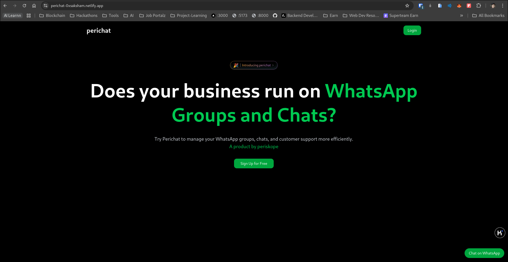
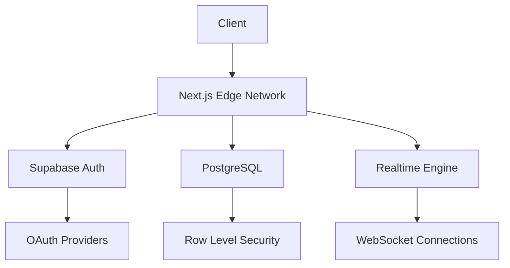

# 🚀 PeriChat - Next-Gen Real-Time Messaging Experience

[](https://nextjs.org/)
[](https://supabase.io/)
[](https://www.typescriptlang.org/)
[](https://app.netlify.com/sites/perichat-0xsaksham/deploys)

**Redefining real-time communication** with blazing-fast messaging, intuitive interface, and enterprise-grade security. PeriChat isn't just another chat app - it's the ultimate solution for modern digital communication.



## 🌟 Features That Set Us Apart

### 🚨 Real-Time Superpowers

- **Instant Message Sync** powered by Supabase Realtime
- **Live Typing Indicators** 👀 See contacts composing
- **Read Receipts** 📨 Know when messages are viewed
- **Presence Detection** 🟢 Online status tracking

### 💎 Premium Communication Tools

- **Advanced Search** 🔍 Find messages/users in milliseconds
- **File Sharing** 📎 Drag & drop documents/media (up to 100MB)
- **Conversation Archive** 🗄️ Never lose important chats
- **Smart Notifications** 🔔 Context-aware alerts

### 🔒 Enterprise-Grade Security

- **Military-Grade Encryption** 🔐 AES-256 message protection
- **2FA Ready** 🛡️ Optional two-factor authentication
- **Session Management** 👥 Device activity monitoring

### 🎨 Ultimate User Experience

- **Dark/Light Mode** 🌗 Eye-friendly themes
- **Responsive Design** 📱 Flawless mobile experience
- **Custom Reactions** ❤️🎉 Express yourself better
- **Message Threads** 🧵 Organized conversations

## 🛠️ Tech Stack Powerhouse

| Layer                | Technology               | Benefit                           |
| -------------------- | ------------------------ | --------------------------------- |
| **Framework**        | Next.js 14 (App Router)  | SSR, SEO, Optimal Performance     |
| **State Management** | React Server Components  | Zero Client-Side JS Bundle        |
| **Realtime Engine**  | Supabase Realtime        | WebSocket-Powered Instant Updates |
| **Styling**          | Tailwind CSS + Shadcn/ui | Atomic Design System              |
| **Authentication**   | Supabase Auth            | Secure JWT Management             |
| **Database**         | Supabase PostgreSQL      | Relational Data Integrity         |
| **Type Safety**      | TypeScript 5             | Enterprise-Grade Code Quality     |

## 🚀 Getting Started in 60 Seconds

### Prerequisites

- Node.js 18+
- Supabase account
- PNPM 8+

### Installation Wizard

````bash
# 1. Clone the repository
git clone https://github.com/yourusername/perichat.git

# 2. Install dependencies
pnpm install

# 3. Setup environment variables
cp .env.example .env.local


### Supabase Configuration

1. Create new project at [supabase.com](https://supabase.com)
2. Enable Realtime for `messages` table
3. Configure Row Level Security (RLS) policies
4. Update environment variables:

```env
NEXT_PUBLIC_SUPABASE_URL=your-supabase-url
NEXT_PUBLIC_SUPABASE_ANON_KEY=your-anon-key
````

### Launch Development

```bash
pnpm dev
```

Visit `http://localhost:3000` to experience the future of messaging!

## 🖥️ System Architecture



## 🤝 Contributing to the Future of Chat

We welcome innovators! Here's how to make your mark:

1. **Fork** the repository
2. Create **feature branch**: `git checkout -b feat/amazing-feature`
3. **Commit** your changes: `git commit -m 'Add amazing feature'`
4. **Push** to branch: `git push origin feat/amazing-feature`
5. Open **Pull Request**

Please read our [contribution guidelines](CONTRIBUTING.md) for best practices.

## 📜 License

PeriChat is MIT licensed - see [LICENSE](LICENSE) for details.

---

**Crafted with ❤️ by Saksham Gupta**

_Powering the next generation of digital communication_

💬 Ask us: sakshamgupta.ai@gmail.com | 🌍 Visit: [Perichat](https://perichat-0xsaksham.netlify.app/)
